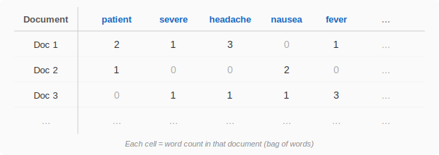

# Hands-on with Orange: Text Mining & Image Analytics

**Herdiantri Sufriyana**
Graduate Institute of Artificial Intelligence and Big Data in Healthcare
National Taiwan University of Nursing and Health Sciences

---

## Table of Contents

1. [Subtopics](#subtopics)
2. [Prerequisites](#prerequisites)
3. [Session 1: Lecture — Text Preprocessing and Word Cloud (10 min)](#session-1-lecture--text-preprocessing-and-word-cloud-10-min)
4. [Session 2: Hands-on — Load and Preprocess Text (15 min)](#session-2-hands-on--load-and-preprocess-text-15-min)
5. [Session 3: Lecture — Sentiment Analysis (5 min)](#session-3-lecture--sentiment-analysis-5-min)
6. [Session 4: Hands-on — Sentiment Analysis (10 min)](#session-4-hands-on--sentiment-analysis-10-min)
7. [Session 5: Lecture — Topic Modeling (5 min)](#session-5-lecture--topic-modeling-5-min)
8. [Session 6: Hands-on — Topic Modeling (10 min)](#session-6-hands-on--topic-modeling-10-min)
9. [Session 7: Lecture — Image Embedding (5 min)](#session-7-lecture--image-embedding-5-min)
10. [Session 8: Hands-on — Load and Embed Images (10 min)](#session-8-hands-on--load-and-embed-images-10-min)
11. [Session 9: Lecture — Image Clustering and Classification (5 min)](#session-9-lecture--image-clustering-and-classification-5-min)
12. [Session 10: Hands-on — Cluster Images (10 min)](#session-10-hands-on--cluster-images-10-min)
13. [Session 11: Hands-on — Classify Images (10 min)](#session-11-hands-on--classify-images-10-min)

---

## Subtopics

- Text preprocessing and visualization
- Sentiment analysis and topic modeling
- Image embedding and similarity
- Image clustering and classification

[Back to Table of Contents](#table-of-contents)

---

## Prerequisites

Install the required add-ons before this session:
1. Open Orange → **Options** → **Add-ons**
2. Check **Orange3-Text** and **Orange3-ImageAnalytics**
3. Click **OK** and restart Orange

Datasets used in this session (both provided in the `data/` folder):
- **Text**: `data/book-excerpts.tab` — ~140 excerpts from classic literature with a Category column (class label). Load via the **Corpus** widget.
- **Image**: `data/flowers/` — 100 flower images (20 per class × 5 classes: daisy, dandelion, roses, sunflowers, tulips), ~7 MB. Load via the **Import Images** widget.

[Back to Table of Contents](#table-of-contents)

---

## Session 1: Lecture — Text Preprocessing and Word Cloud (10 min)

- Text mining extracts meaningful patterns from unstructured text data
- Computers cannot process raw text directly — text must be converted to numbers
- **Preprocessing pipeline**: raw text → lowercase → split into words (tokenize) → remove common words (stopwords) → filter rare/frequent words
- **Tokenization** converts text into a document-term matrix — each row is a document, each column is a word, and each cell is the word count:

- A **word cloud** visualizes which terms appear most often — larger words = higher frequency
- Preprocessing determines what the downstream analysis sees: garbage in, garbage out

*Can you guess why removing stopwords (the, and, is, ...) is important before analysis?*

[Back to Table of Contents](#table-of-contents)

---

## Session 2: Hands-on — Load and Preprocess Text (15 min)

**Widgets:** Corpus, Preprocess Text, Corpus Viewer, Word Cloud (x2)

1. Drag **Corpus** onto the canvas → load `data/book-excerpts.tab`
   - The **Text** field and **Class** (Category) are already set
2. Connect **Corpus** → **Corpus Viewer** via **Corpus** — inspect individual documents
3. Connect **Corpus** → **Word Cloud** (label it "Word Cloud (raw)") via **Corpus** — visualize frequent terms before preprocessing
4. Connect **Corpus** → **Preprocess Text** via **Corpus**
   - Add transformations in order:
     - **Lowercase**
     - **Tokenize** — select **Word & Punctuation**
     - **Filter** — remove **Stopwords** (select English)
     - **Filter** — by **Document Frequency**, Absolute: min **2**, max **max**
5. Connect **Preprocess Text** → **Word Cloud** (label it "Word Cloud (preprocessed)") via **Corpus**

**Check these:**
- Compare the two word clouds — which terms disappeared after preprocessing?
- Does the preprocessed word cloud show meaningful content words instead of stopwords?
- Are there domain-specific stopwords you should add?

[Back to Table of Contents](#table-of-contents)

---

## Session 3: Lecture — Sentiment Analysis (5 min)

- Sentiment analysis scores text on a **positive–negative** scale automatically
- Uses a **lexicon** (dictionary of words with pre-assigned sentiment scores)
- **Vader** (Valence Aware Dictionary and sEntiment Reasoner) is a popular lexicon-based method
- Outputs per document: **neg** (negative), **neu** (neutral), **pos** (positive), **compound** (overall score from −1 to +1)
- Useful in healthcare: patient reviews, social media health discussions, clinical note tone

*Can you guess what a compound score of −0.8 vs +0.9 means?*

[Back to Table of Contents](#table-of-contents)

---

## Session 4: Hands-on — Sentiment Analysis (10 min)

**Widgets:** Sentiment Analysis, Data Table, Distributions

6. Connect **Preprocess Text** → **Sentiment Analysis** via **Corpus**
   - Select method: **Vader** (works well for English text)
7. Connect **Sentiment Analysis** → **Data Table** (label it "Sentiment Analysis Scores") via **Corpus → Data** — inspect sentiment scores per document
   - Vader outputs: **neg**, **neu**, **pos**, and **compound** scores
8. Connect **Sentiment Analysis** → **Distributions** (label it "Compound Score Distributions") via **Corpus → Data**
   - Select the **compound** variable
   - If a class variable is set, distributions are split by class automatically

**Check these:**
- What is the overall sentiment distribution?
- Do different categories (classes) differ in sentiment?

[Back to Table of Contents](#table-of-contents)

---

## Session 5: Lecture — Topic Modeling (5 min)

- Topic modeling discovers **hidden themes** (topics) in a collection of documents
- Each topic is a group of words that frequently co-occur across documents
- **LDA** (Latent Dirichlet Allocation) assumes each document is a mixture of topics, and each topic is a mixture of words
- Input: a **bag of words** — a table where each row is a document and each column is a word count (word order is ignored)
- Two ways to count words in the bag of words:
  - **TF**(t, d) = count of word t in document d
  - **IDF**(t) = log(N / df(t)), where N = total documents, df(t) = number of documents containing word t
  - **TF-IDF**(t, d) = TF(t, d) × IDF(t) — downweights words that appear in many documents (e.g., "said" appears everywhere → high df → low IDF → low TF-IDF), upweights words that are distinctive to specific documents
- Output: topic–word distributions (what words define each topic) and document–topic distributions (which topics each document belongs to)

*Can you guess why it's called a "bag" of words?*

[Back to Table of Contents](#table-of-contents)

---

## Session 6: Hands-on — Topic Modeling (10 min)

**Widgets:** Bag of Words, Topic Modelling, Select Columns, Data Table, Distributions

9. Connect **Preprocess Text** → **Bag of Words** via **Corpus**
   - Set Term Frequency: **Count**, Document Frequency: **IDF**
10. Connect **Bag of Words** → **Topic Modelling** via **Corpus**
    - Set method: **Latent Dirichlet Allocation (LDA)**
    - Set **Number of topics**: start with **3**
11. Connect **Topic Modelling** → **Select Columns** (label it "Select Topic Columns") via **Corpus → Data**
    - Move **Topic 1**, **Topic 2**, **Topic 3** to **Features**
    - Keep **Category** in **Target** and **Text** in **Metas**
    - Move all other columns (bow features) to **Ignored**
12. Connect **Select Topic Columns** → **Data Table** (label it "Topic Scores") via **Data** — each document shows its topic probabilities
13. Connect **Topic Scores** → **Distributions** (label it "Topic Score Distributions") via **Selected Data → Data**
    - Select a topic variable (e.g., **Topic 1**) to see how its scores distribute across categories

**Check these:**
- Do the topic assignments match the class labels? (In the Topic Scores table, check if documents with the same Category tend to have high probability on the same topic — e.g., do all "children" documents score highest on Topic 1?)
- In Topic Score Distributions, do the categories separate on different topics?

[Back to Table of Contents](#table-of-contents)

---

## Session 7: Lecture — Image Embedding (5 min)

- A computer sees an image as a grid of pixel values — it has no concept of "flower" or "cat"
- **Image embedding** uses a pre-trained neural network to convert each image into a **feature vector** (a list of numbers that capture visual patterns)
- Similar images produce similar vectors — this enables measuring image similarity, clustering, and classification
- **SqueezeNet** is a small, fast neural network suitable for classroom use
- The embedding is computed on a remote server — no GPU needed on your laptop

*Can you guess why we use a pre-trained network instead of training one from scratch?*

[Back to Table of Contents](#table-of-contents)

---

## Session 8: Hands-on — Load and Embed Images (10 min)

**Widgets:** Import Images, Image Viewer, Image Embedding, Image Grid

1. Drag **Import Images** onto the canvas → point to the `data/flowers/` folder
   - The 5 subfolders (daisy, dandelion, roses, sunflowers, tulips) become class labels automatically
2. Connect **Import Images** → **Image Viewer** via **Data** — browse the loaded images
3. Connect **Import Images** → **Image Embedding** via **Data → Images**
   - Select embedder: **SqueezeNet** (fast, good for most tasks)
   - Wait for embedding to complete (progress bar in the widget)
4. Connect **Image Embedding** → **Image Grid** via **Embeddings**
   - Set **Label** to **Category**
   - Images are arranged by similarity — similar images cluster together

**Check these:**
- How many images per class were loaded?
- In the Image Grid, do images of the same class appear near each other?
- Are there any obvious misplacements?

[Back to Table of Contents](#table-of-contents)

---

## Session 9: Lecture — Image Clustering and Classification (5 min)

- Once images are converted to feature vectors, we can apply the same data mining techniques as with tabular data:
  - **Distances** → compute pairwise similarity between images
  - **Hierarchical Clustering** → group similar images into clusters (unsupervised)
  - **Classification** → train a model to predict the class label from the embedding (supervised)
- This is the same workflow as Week 11 Steps 4–5, but applied to images instead of patient data
- Key question: do the visual clusters match the true class labels?

*Can you guess which flower types might be hardest to distinguish?*

[Back to Table of Contents](#table-of-contents)

---

## Session 10: Hands-on — Cluster Images (10 min)

**Widgets:** Distances, Hierarchical Clustering, Image Viewer

5. Connect **Image Embedding** → **Distances** via **Embeddings → Data**
6. Connect **Distances** → **Hierarchical Clustering** via **Distances**
   - Set **Annotation** to **Category** and **Color** to **Category**
   - Cut the dendrogram to form clusters
7. Connect **Hierarchical Clustering** → **Image Viewer** (label it "Image Viewer (clustered)") via **Selected Data → Data**
   - Click different clusters in the dendrogram to see which images belong to each

**Check these:**
- Do hierarchical clusters correspond to the class labels?
- Which flower types end up in the same cluster?

[Back to Table of Contents](#table-of-contents)

---

## Session 11: Hands-on — Classify Images (10 min)

**Widgets:** Test & Score, Logistic Regression, Confusion Matrix

8. Connect **Image Embedding** → **Test & Score** (label it "5-Fold Cross-Validation") via **Embeddings → Data**
   - Set evaluation to **5-Fold Cross Validation**
9. Drag **Logistic Regression** onto the canvas
   - Set **Regularization** to **No regularization**
10. Connect **Logistic Regression** → **5-Fold Cross-Validation** via **Learner**
11. Drag **Tree** onto the canvas → connect **Tree** → **5-Fold Cross-Validation** via **Learner**
12. Drag **kNN** onto the canvas → connect **kNN** → **5-Fold Cross-Validation** via **Learner**
    - Note the **AUC** and **CA** (classification accuracy) for each classifier
13. Connect **5-Fold Cross-Validation** → **Confusion Matrix** via **Evaluation Results**
    - Which classes are most often confused?

**Check these:**
- Which classifier achieves the highest AUC?
- Which class pairs are hardest to distinguish?

[Back to Table of Contents](#table-of-contents)
