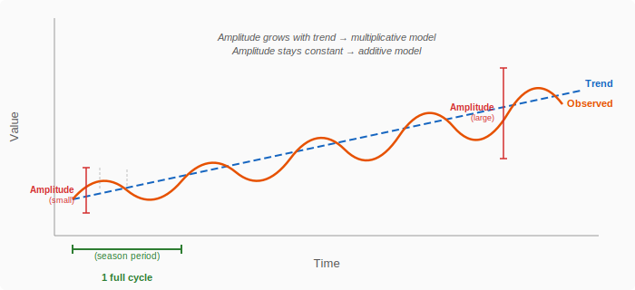
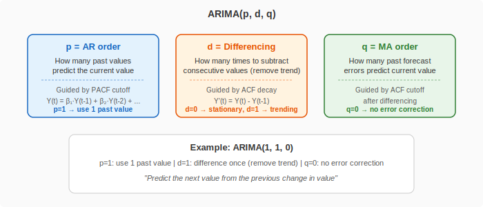
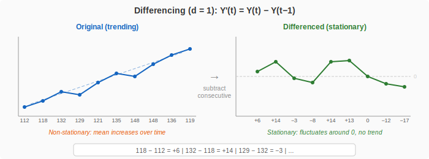

# Hands-on with Orange: Time Series Analysis

**Herdiantri Sufriyana**
Graduate Institute of Artificial Intelligence and Big Data in Healthcare
National Taiwan University of Nursing and Health Sciences

---

## Table of Contents

1. [Subtopics](#subtopics)
2. [Prerequisites](#prerequisites)
3. [Session 1: Lecture — What is Time Series? (10 min)](#session-1-lecture--what-is-time-series-10-min)
4. [Session 2: Hands-on — Load and Visualize (10 min)](#session-2-hands-on--load-and-visualize-10-min)
5. [Session 3: Lecture — Decomposition (10 min)](#session-3-lecture--decomposition-10-min)
6. [Session 4: Hands-on — Decompose Time Series (10 min)](#session-4-hands-on--decompose-time-series-10-min)
7. [Session 5: Lecture — Autocorrelation (10 min)](#session-5-lecture--autocorrelation-10-min)
8. [Session 6: Hands-on — Autocorrelation (10 min)](#session-6-hands-on--autocorrelation-10-min)
9. [Session 7: Lecture — ARIMA (10 min)](#session-7-lecture--arima-10-min)
10. [Session 8: Hands-on — ARIMA Forecasting (15 min)](#session-8-hands-on--arima-forecasting-15-min)

---

## Subtopics

- Loading and visualizing time series data
- Decomposing trend, seasonality, and residuals
- Autocorrelation and periodicity
- Forecasting with ARIMA

[Back to Table of Contents](#table-of-contents)

---

## Prerequisites

Install the required add-on before this session:
1. Open Orange → **Options** → **Add-ons**
2. Check **Orange3-Timeseries**
3. Click **OK** and restart Orange

Dataset used in this session (provided in the `data/` folder):
- **`data/airpassengers.csv`** — monthly international airline passengers from 1949 to 1960 (144 rows). Classic time series dataset with clear trend and seasonality. Load via the **File** widget.

[Back to Table of Contents](#table-of-contents)

---

## Session 1: Lecture — What is Time Series? (10 min)

- A **time series** is a sequence of data points ordered by time (e.g., daily stock prices, monthly patient counts, yearly disease incidence)
- Unlike cross-sectional data (one snapshot), time series captures **change over time**
- Three components can be present in a time series:
  - **Trend** — long-term upward or downward movement
  - **Seasonality** — repeating pattern at fixed intervals (e.g., flu peaks every winter)
  - **Residual** — random noise after removing trend and seasonality

- Goal of time series analysis: separate these components to understand the underlying pattern and forecast future values

*Can you guess which component is most useful for prediction — trend, seasonality, or residual?*

[Back to Table of Contents](#table-of-contents)

---

## Session 2: Hands-on — Load and Visualize (10 min)

**Widgets:** File, Form Timeseries, Line Chart

1. Drag **File** onto the canvas → load `data/airpassengers.csv`
   - Set **Passengers** as **Target** (required by ARIMA Model later)
2. Connect **File** → **Form Timeseries** via **Data**
   - Set the **time variable** to **Month**
3. Connect **Form Timeseries** → **Line Chart** via **Time series**
   - Select **Passengers** to plot

**Check these:**
- Can you identify an overall trend (upward)?
- Is there a repeating seasonal pattern (peaks every summer)?
- Does the seasonal amplitude grow over time?

[Back to Table of Contents](#table-of-contents)

---

## Session 3: Lecture — Decomposition (10 min)

- **Decomposition** separates a time series into its three components: Trend + Seasonality + Residual
- Two models:
  - **Additive**: Y(t) = Trend(t) + Seasonal(t) + Residual(t) — use when seasonal amplitude is constant over time
  - **Multiplicative**: Y(t) = Trend(t) × Seasonal(t) × Residual(t) — use when seasonal amplitude grows with the trend
- **Season period** must be specified: how many time steps make one full cycle?
  - Monthly data with yearly pattern → period = 12
  - Daily data with weekly pattern → period = 7
- After decomposition, inspect each component separately:
  - Trend tells you the long-term direction
  - Seasonal tells you the repeating pattern
  - Residual should look like random noise — if it has a pattern, the decomposition is incomplete

*Can you guess whether airline passengers are better modeled with additive or multiplicative decomposition?*

[Back to Table of Contents](#table-of-contents)

---

## Session 4: Hands-on — Decompose with Moving Average (15 min)

**Widgets:** Moving Transform, Formula, Line Chart (x2)

**Detrended** means "trend removed" — what remains after subtracting (additive) or dividing out (multiplicative) the trend from the original series. The detrended series shows the seasonal pattern and residual noise without the long-term growth.

4. Connect **Form Timeseries** → **Moving Transform** via **Time series**
   - Add transform: **Mean**, window size **12** (12-month moving average = trend)
5. Connect **Moving Transform** → **Formula** (label it "Compute detrended") via **Time series → Data**
   - Add new variable: **Detrended_mult** = `Passengers / Passengers_mean` (multiplicative: wave around 1.0)
   - Add new variable: **Detrended_add** = `Passengers - Passengers_mean` (additive: wave around 0)
6. Connect **Formula** → **Line Chart** (label it "Decomposition") via **Data → Time series**
   - Plot 1: select **Passengers** and **Passengers (mean)** — original with trend overlay
   - Plot 2: select **Detrended_mult** — repeating wave around 1.0
   - Plot 3: select **Detrended_add** — repeating wave around 0

**Check these:**
- Does the trend (moving average) show the overall growth clearly?
- Do the detrended plots show a repeating 12-month pattern?
- Does the gap between original and trend grow over time? (If yes → multiplicative is better)
- Compare the two detrended plots — which one shows a more consistent amplitude over time?

[Back to Table of Contents](#table-of-contents)

---

## Session 5: Lecture — Autocorrelation (10 min)

- **Autocorrelation** measures how much a time series correlates with its own past values (lags)
- **ACF** (Autocorrelation Function) — correlation at each lag (includes indirect effects through intermediate lags)
- **PACF** (Partial Autocorrelation Function) — direct correlation at each lag (removes intermediate effects)
- Significant spikes above the confidence band indicate meaningful lags

- A slowly decaying ACF suggests the series is **non-stationary** (has a trend) and needs differencing
- A sharp PACF cutoff tells you how many past values directly matter

*Can you guess what it means if the ACF never decays?*

[Back to Table of Contents](#table-of-contents)

---

## Session 6: Hands-on — Autocorrelation (10 min)

**Widgets:** Correlogram (x2)

6. Connect **Form Timeseries** → **Correlogram** (label it "Correlogram (ACF)") via **Time series**
   - Uncheck **Compute partial auto-correlation**
   - Check **Plot 95% significance interval**
7. Connect **Form Timeseries** → **Correlogram** (label it "Correlogram (PACF)") via **Time series**
   - Check **Compute partial auto-correlation**
   - Check **Plot 95% significance interval**

**How to read the Correlograms:**
- Bars above/below the dashed line (95% CI) are **significant**
- **ACF**: lag 1 is high (~0.8), and bars decay slowly → the series is non-stationary → **d = 1**
- **PACF**: only lag 1 is significant (~0.2), the rest fall inside the CI → direct effect at 1 lag only → **p = 1**

**Check these:**
- Does the ACF decay slowly? (If yes → d = 1)
- At which lag does the PACF cut off? (That lag → p)

[Back to Table of Contents](#table-of-contents)

---

## Session 7: Lecture — ARIMA (10 min)

- **ARIMA**(p, d, q) is a model for forecasting time series:

- **Differencing** (d) removes the trend by subtracting consecutive values:

- ARIMA combines trend removal (d), past values (p), and past errors (q) into one model
- Use ACF/PACF from Session 6 to choose parameters:
  - **p** → PACF cutoff lag (from Session 6)
  - **d** → 0 if stationary, 1 if trending (ACF decays slowly, from Session 6)
  - **q** → requires ACF of the differenced series, which is hard to compute in Orange. Start with **q = 0**, then try q = 1 and compare RMSE

*Can you guess what ARIMA(1,1,0) means in plain English?*

[Back to Table of Contents](#table-of-contents)

---

## Session 8: Hands-on — ARIMA Forecasting (15 min)

**Widgets:** ARIMA Model, Line Chart, Model Evaluation

*Compare models:*

8. Create three **ARIMA Model** widgets with different q values, all with p=1, d=1:
   - **ARIMA Model q=0**: set ARIMA(1,1,0), Forecast steps ahead: **12**
   - **ARIMA Model q=3**: set ARIMA(1,1,3), Forecast steps ahead: **12**
   - **ARIMA Model q=6**: set ARIMA(1,1,6), Forecast steps ahead: **12**
9. Connect **Form Timeseries** → each ARIMA Model via **Time series**
10. Connect **Form Timeseries** → **Model Evaluation** via **Time series → Time series**
11. Connect all three ARIMA Models → **Model Evaluation** via **Time series model → Time series model**
    - Set **Number of folds**: **5**, **Forecast steps**: **12**
    - Compare out-of-sample **RMSE** and **R²** — pick the model with lowest RMSE

*Forecast with the best model:*

12. Connect **Form Timeseries** → **Line Chart** (label it "ARIMA Forecast") via **Time series → Time series**
13. Connect the best ARIMA Model → **ARIMA Forecast** (same Line Chart) via **Forecast → Forecast**
    - The forecast with 95% CI is overlaid on the original series

**Check these:**
- Which q value gives the lowest out-of-sample RMSE?
- Does the forecast continue the original series smoothly?
- Are the confidence intervals narrow or very wide?

[Back to Table of Contents](#table-of-contents)
